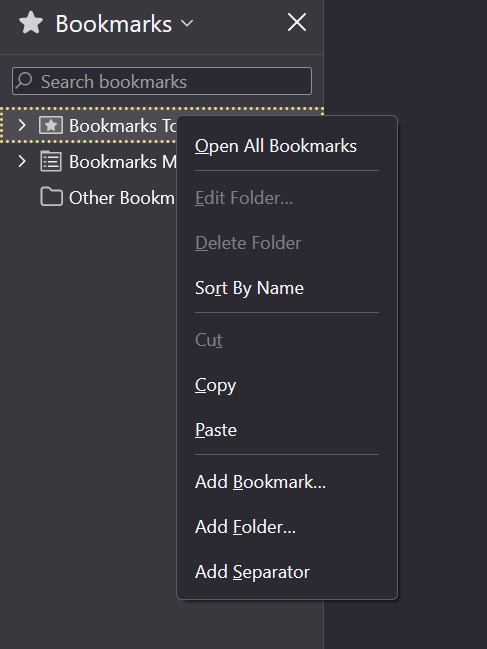
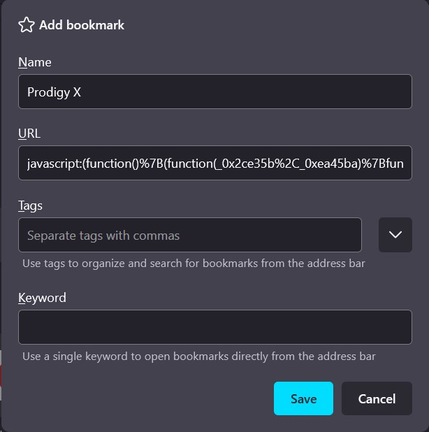
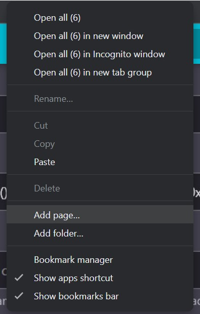
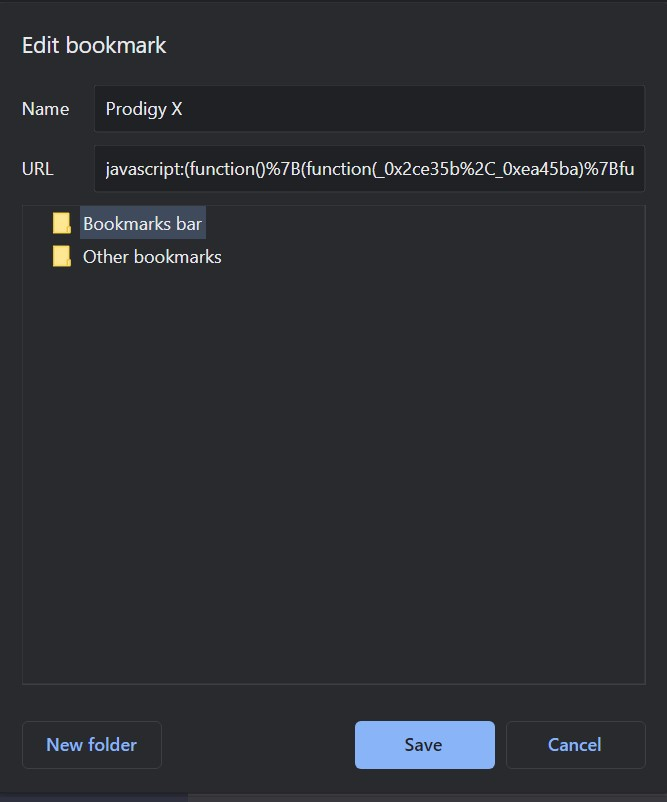

# Creating Bookmarks

To use Prodigy X, you must create a bookmark.

If you don't know how to create a bookmark, this page will teach you how to.

<!-- Ad Unit 1 -->
<ins class="adsbygoogle"
     style="display:block"
     data-ad-client="ca-pub-8981394123170949"
     data-ad-slot="1878857878"
     data-ad-format="auto"
     data-full-width-responsive="true"></ins>

## Firefox

1. To create a bookmark on firefox you need to open the bookmarks bar. You can do this by pressing ++ctrl+b++.
2. Now right click on the Bookmarks Toolbar folder and select **Add Bookmark**.
    
   

   
   

3. Now you will be able to create a bookmark.
    
   

   
   

<!-- Ad Unit 1 -->
<ins class="adsbygoogle"
     style="display:block"
     data-ad-client="ca-pub-8981394123170949"
     data-ad-slot="1878857878"
     data-ad-format="auto"
     data-full-width-responsive="true"></ins>

## Chrome

1. Make the bookmark bar visible. If it is not visible you can make it visible by press ++ctrl+shift+b++.
2. Right click the bookmark bar and select **Add Page**.
    
   

   
   

3. Now you will be able to create a bookmark.
    
   

   
   

<!-- Ad Unit 1 -->
<ins class="adsbygoogle"
     style="display:block"
     data-ad-client="ca-pub-8981394123170949"
     data-ad-slot="1878857878"
     data-ad-format="auto"
     data-full-width-responsive="true"></ins>
